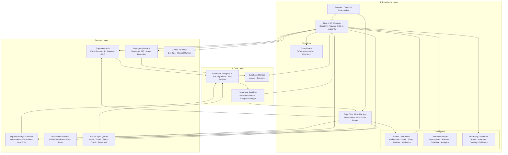

<div align="center">

<video width="180" height="180" autoplay loop muted playsinline>
  <source src="./public/logo/video/logo_animation.mp4" type="video/mp4">
  
</video>

# ZorabiHealth

**Clinical Operations Platform — Patients · Doctors · Pharmacies**

[](https://nextjs.org)
[](https://react.dev)
[](https://expo.dev)
[](https://supabase.io)
[](https://deepgram.com)
[](https://deepmind.google/gemini)

---

ZorabiHealth unifies patient dashboards, voice logging, medication reminders,
prescriptions, messaging, and Supabase-powered workflows in one product.

</div>

---

## Architecture



## Project Structure

```
zorabihealth/                          # Web Application (Next.js 16)
├── app/                               # Routes & pages (App Router)
│   ├── (marketing)/                   # Landing page, use cases, pricing
│   ├── api/                           # 14 API endpoint groups
│   │   ├── auth/                      # Role registration
│   │   ├── deepgram/                  # Voice token
│   │   ├── gemini/                    # AI chat, meals
│   │   ├── medications/              # CRUD
│   │   ├── notifications/            # Push, pairing, devices
│   │   ├── orders/                   # V1/V2 order tracking
│   │   ├── pharmacy/                 # Store products
│   │   ├── reviews/                  # Product reviews
│   │   └── workouts/                 # CRUD, streaks, nutrition
│   ├── dashboard/                    # Role-based dashboards
│   │   ├── doctor/                   # Doctor workspace
│   │   ├── pharmacy/                 # Pharmacy portal
│   │   └── patient/                  # Patient hub
│   ├── auth/                         # Login, signup
│   └── zobraipharm/                  # Pharmacy storefront
├── components/                       # Shared UI components
│   ├── ui/                           # shadcn primitives
│   └── marketing/                    # Marketing components
├── hooks/                            # React hooks
├── lib/                              # API clients & helpers
│   ├── supabase.ts                   # Supabase client
│   ├── gemini.ts                     # Gemini AI client
│   ├── notifications.ts             # Push notification logic
│   └── alarm-queue.ts               # Alarm scheduling
├── packages/
│   └── shared/                       # @zorabihealth/shared
│       ├── types/                    # Shared TS types
│       └── lib/                      # Offline queue, sync
├── public/                           # Static assets
│   ├── logo/                         # Logo assets
│   ├── images/                       # Images & pharmacy products
│   └── video/                        # Marketing videos
├── supabase/                         # Edge Functions & migrations
│   ├── functions/                    # 5 Deno Edge Functions
│   └── migrations/                   # 31+ SQL migrations
├── docs/                             # Documentation
└── __tests__/                        # Test stubs

zorabihealth-mobile/                   # Mobile App (Expo SDK 56)
├── app/                              # Expo Router screens
│   ├── (auth)/                       # Login, QR scan
│   └── (tabs)/                       # Home, Medications, Vitals, Settings
├── components/                       # Mobile-specific components
├── lib/                              # Mobile helpers
│   ├── background-sync.ts            # Background task sync
│   ├── alarm-queue.ts                # Mobile alarm scheduling
│   └── realtime-notifications.ts     # Supabase Realtime subs
├── assets/                           # Fonts, icons, splash
├── constants/                        # Config constants
├── app.json                          # Expo config
└── eas.json                          # EAS Build profiles
```

## Tech Stack

| Category           | Technologies                                                                                              |
| ------------------ | --------------------------------------------------------------------------------------------------------- |
| **Web**            | Next.js 16, React 19, TypeScript, Tailwind CSS 4, shadcn/ui, Radix UI, Framer Motion, Lucide React, Lenis |
| **Mobile**         | Expo SDK 56, React Native 0.85, Expo Router, TypeScript, Expo Sensors, Expo Camera                        |
| **Backend**        | Supabase (PostgreSQL 17, Auth, Realtime, Storage, Edge Functions / Deno)                                  |
| **AI**             | Deepgram Nova-3 (speech-to-text), Google Gemini 1.5 Flash (content generation)                            |
| **Notifications**  | Web Push (VAPID), Expo Push, Expo Background Tasks, Supabase Realtime                                     |
| **Integrations**   | jose (JWT), jsPDF (prescriptions), qrcode.react, date-fns, node-cron, web-push                            |
| **Infrastructure** | Vercel (web), EAS Build (mobile APK), Supabase Cloud, GitHub Actions                                      |
| **Shared**         | `@zorabihealth/shared` — types, offline queue, vector clock conflict resolution                           |

## Features

- **Patient Dashboard** — medication reminders, adherence tracking, vitals, sleep, workout, meditation
- **Doctor Dashboard** — prescriptions (PDF export), patient records, appointments, analytics
- **Pharmacy Portal** — order fulfillment, inventory, drug catalog, vendor management
- **Voice Assistant** — Deepgram STT with intent detection (12+ medical actions)
- **ZorabiPharm Store** — e-commerce pharmacy with cart & checkout
- **Mobile App** — on-the-go medication & vitals tracking, QR device pairing, background alarms
- **Real-time Sync** — Supabase Realtime across web + mobile + notifications
- **Offline-first** — shared offline queue with vector clock conflict resolution
- **Emergency Escalation** — automated missed-dose alerts to emergency contacts
- **Device Pairing** — QR code + same-email cross-device linking

## Getting Started

```bash
# 1. Clone & install
npm install

# 2. Set environment variables
cp .env.local.example .env.local
# Add Supabase, Deepgram, Gemini, and notification keys

# 3. Start development
npm run dev

# 4. Mobile (from zorabihealth-mobile/)
npx expo start
```

## Build Commands

```bash
# Web
npm run build                    # Next.js production build

# Mobile APK (from zorabihealth-mobile/)
npx eas build --platform android --profile preview
npx eas build --platform android --profile production
```

## Documentation

| Document                  | Description                      |
| ------------------------- | -------------------------------- |
| `docs/overview.md`        | Platform overview & key benefits |
| `docs/getting-started.md` | Setup & configuration            |
| `docs/core-concepts.md`   | Core concepts & terminology      |
| `docs/features.md`        | Feature guides                   |
| `docs/integrations.md`    | API & integration reference      |
| `docs/troubleshooting.md` | FAQ & known issues               |

---

<div align="center">
  <sub>Built with Next.js 16 · React 19 · Expo SDK 56 · Supabase · Deepgram · Gemini</sub>
</div>
