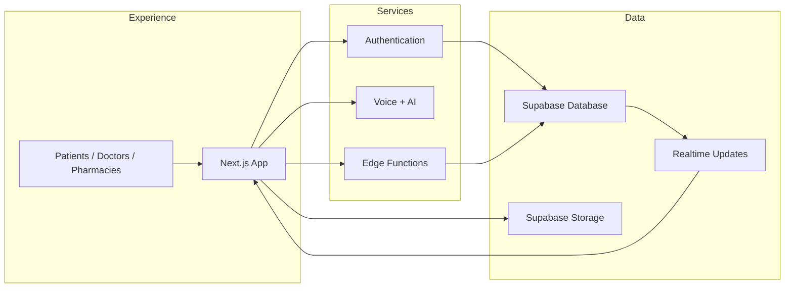

# ZorabiHealth

ZorabiHealth is a clinical operations platform for patients, doctors, and pharmacies. It unifies patient dashboards, voice logging, medication reminders, prescriptions, messaging, and Supabase-powered workflows in one product.

## Overview

ZorabiHealth helps care teams and patients work from the same source of truth.

- Keep patient health actions in one place
- Route reminders to the right user and device
- Support doctor, patient, and pharmacy workflows
- Capture voice notes and clinical actions quickly
- Store and sync data with Supabase

## Architecture

The platform is built as three layers: experience, services, and data.



## Features

- Patient dashboard with personalized summaries
- Voice assistant for fast health logging
- Medication reminders and adherence tracking
- Doctor prescriptions and appointment workflows
- Pharmacy fulfillment and order tracking
- Realtime notifications and device sync

## Getting Started

1. Copy `.env.local.example` to `.env.local`.
2. Add your Supabase, Deepgram, Gemini, and notification keys.
3. Install dependencies with `npm install`.
4. Start the app with `npm run dev`.
5. Open `http://localhost:3000`.

> **Tip:** Deploy the matching Supabase migrations and Edge Functions before testing reminders, voice, or notifications.

## Documentation

Read the full docs site here:

- `docs/README.md`
- `docs/overview.md`
- `docs/getting-started.md`
- `docs/core-concepts.md`
- `docs/features.md`
- `docs/configuration.md`
- `docs/integrations.md`
- `docs/troubleshooting.md`
- `docs/changelog.md`
- `docs/glossary.md`

## Project Structure

```text
zorabihealth/
├── app/         Next.js routes and dashboards
├── components/  Shared UI components
├── hooks/       React hooks
├── lib/         Shared helpers and clients
├── public/      Static assets
├── supabase/    SQL migrations and Edge Functions
├── docs/        Documentation files
└── README.md    Project overview
```

## Development

- `npm install`
- `npm run dev`
- `npm run lint`
- `npm run typecheck`

---

For the full documentation site, open `docs/README.md`.
