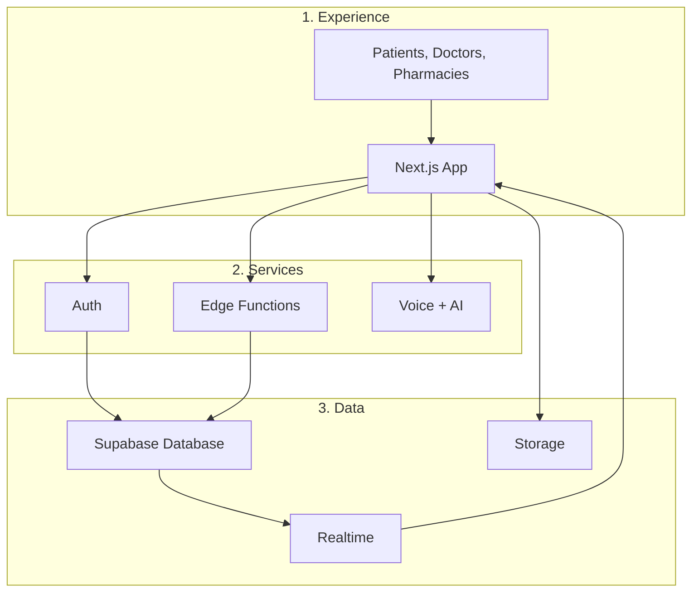

# ZorabiHealth Documentation

This documentation covers the ZorabiHealth platform, from first setup through feature usage and troubleshooting.

## Documentation Map

- [Overview](./overview.md)
- [Getting Started](./getting-started.md)
- [Core Concepts](./core-concepts.md)
- [Features & How-To Guides](./features.md)
- [Configuration & Settings](./configuration.md)
- [API / Integrations](./integrations.md)
- [Troubleshooting & FAQ](./troubleshooting.md)
- [Changelog / Release Notes](./changelog.md)
- [Glossary](./glossary.md)

## Platform Architecture

> **Note:** The docs are written to stand alone. Each page includes enough context to make sense on its own.

## Recommended Reading Order

1. `overview.md`
2. `getting-started.md`
3. `core-concepts.md`
4. `features.md`
5. `configuration.md`
6. `integrations.md`
7. `troubleshooting.md`

## What This Platform Solves

ZorabiHealth reduces the number of disconnected tools needed for care coordination. It keeps patient health actions, clinical communication, and reminder workflows inside one system.
