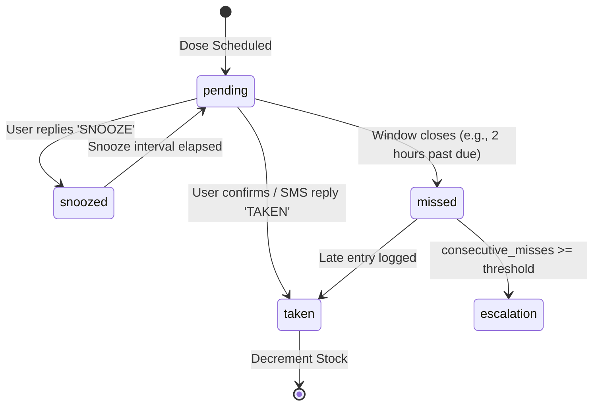

# ZorabiHealth — Production-Grade Medicine Tracking & Alert Specifications

This document defines the comprehensive architecture, data structures, scheduling logic, security requirements, and loopback communication systems required to build a production-grade, HIPAA-compliant medicine tracking platform.

---

## 1. Data Architecture & PostgreSQL DDL

To support offline-first sync, transaction audits, and complex schedules, the database must enforce strict integrity.

```sql
-- Enable UUID and cryptographic extensions
CREATE EXTENSION IF NOT EXISTS "uuid-ossp";
CREATE EXTENSION IF NOT EXISTS pgcrypto;

-- Enums for state machine and scheduling
CREATE TYPE medication_frequency AS ENUM ('daily', 'twice_daily', 'three_times_daily', 'weekly', 'as_needed');
CREATE TYPE adherence_status AS ENUM ('taken', 'missed', 'snoozed', 'pending');
CREATE TYPE order_status AS ENUM ('PENDING', 'CONFIRMED', 'PREPARING', 'DISPATCHED', 'DELIVERED', 'CANCELLED');

-- 1. Core Medications Table
CREATE TABLE medications (
    id UUID PRIMARY KEY DEFAULT gen_random_uuid(),
    user_id UUID NOT NULL,
    name VARCHAR(255) NOT NULL CHECK (char_length(name) >= 1),
    generic_name VARCHAR(255),
    dosage VARCHAR(100) NOT NULL, -- e.g. "500mg", "1 tablet"
    frequency medication_frequency NOT NULL,
    scheduled_times TIME[] NOT NULL CHECK (cardinality(scheduled_times) > 0), -- e.g. ['08:00:00', '20:00:00']
    timezone VARCHAR(100) NOT NULL DEFAULT 'UTC', -- Store timezone context for DST evaluation
    start_date DATE NOT NULL,
    end_date DATE,
    refill_at INTEGER NOT NULL DEFAULT 7 CHECK (refill_at >= 0),
    current_stock INTEGER NOT NULL DEFAULT 30 CHECK (current_stock >= 0),
    prescribed_by VARCHAR(255),
    phone_for_alerts VARCHAR(30) CHECK (phone_for_alerts ~ '^\+[1-9]\d{1,14}$'), -- Enforces E.164
    emergency_contact_name VARCHAR(255),
    emergency_contact_phone VARCHAR(30) CHECK (emergency_contact_phone ~ '^\+[1-9]\d{1,14}$'),
    alert_after_misses INTEGER DEFAULT 2 CHECK (alert_after_misses > 0),
    is_active BOOLEAN NOT NULL DEFAULT TRUE,
    created_at TIMESTAMP WITH TIME ZONE DEFAULT timezone('utc'::text, now()) NOT NULL,
    updated_at TIMESTAMP WITH TIME ZONE DEFAULT timezone('utc'::text, now()) NOT NULL,
    CONSTRAINT chk_end_date CHECK (end_date IS NULL OR end_date >= start_date)
);

-- Indices for rapid indexing
CREATE INDEX idx_meds_user_active ON medications(user_id, is_active);
CREATE INDEX idx_meds_phone_lookup ON medications(phone_for_alerts) WHERE is_active = TRUE;

-- 2. Medication Intake Logs (Adherence Records)
CREATE TABLE medication_logs (
    id UUID PRIMARY KEY DEFAULT gen_random_uuid(),
    medication_id UUID NOT NULL REFERENCES medications(id) ON DELETE CASCADE,
    scheduled_at TIMESTAMP WITH TIME ZONE NOT NULL,
    taken_at TIMESTAMP WITH TIME ZONE,
    status adherence_status NOT NULL DEFAULT 'pending',
    dose VARCHAR(100) NOT NULL,
    note TEXT,
    alert_sent BOOLEAN NOT NULL DEFAULT FALSE,
    consecutive_miss_count INTEGER NOT NULL DEFAULT 0,
    snoozed_until TIMESTAMP WITH TIME ZONE,
    created_at TIMESTAMP WITH TIME ZONE DEFAULT timezone('utc'::text, now()) NOT NULL,
    updated_at TIMESTAMP WITH TIME ZONE DEFAULT timezone('utc'::text, now()) NOT NULL,
    -- Prevent duplicate scheduled logs for the same medication slot
    CONSTRAINT unique_medication_schedule_slot UNIQUE (medication_id, scheduled_at)
);

CREATE INDEX idx_med_logs_lookup ON medication_logs(medication_id, scheduled_at, status);
CREATE INDEX idx_med_logs_status ON medication_logs(status) WHERE status = 'pending';

-- 3. Audit Trails Table for HIPAA Audit logging
CREATE TABLE medication_audit_trails (
    id UUID PRIMARY KEY DEFAULT gen_random_uuid(),
    medication_id UUID,
    actor_id UUID NOT NULL, -- User/Admin performing action
    action_type VARCHAR(50) NOT NULL, -- 'INSERT', 'UPDATE', 'DELETE'
    old_state JSONB,
    new_state JSONB,
    timestamp TIMESTAMP WITH TIME ZONE DEFAULT timezone('utc'::text, now()) NOT NULL
);
```

---

## 2. Timezone & Scheduling Engine

Medication schedules must compute dynamically relative to local time, adjusting for UTC offsets and Daylight Saving Time (DST) transitions.

### Next Schedule Calculator (TypeScript)

This routine calculates the exact UTC target for the next medication dose, respecting timezone rules.

```typescript
import { zonedTimeToUtc, utcToZonedTime, formatInTimeZone } from "date-fns-tz";
import { addDays, parse, isAfter } from "date-fns";

interface ScheduleParams {
  scheduledTimes: string[]; // ['08:00', '20:00']
  timezone: string; // 'Asia/Kolkata', 'America/New_York'
  lastScheduledUtc: Date;
}

export function calculateNextScheduledDoses(params: ScheduleParams, targetLimitDays = 7): Date[] {
  const { scheduledTimes, timezone, lastScheduledUtc } = params;
  const nextDates: Date[] = [];

  // Start calculating from the day of the last scheduled dose
  const zonedAnchorDate = utcToZonedTime(lastScheduledUtc, timezone);
  const anchorDateStr = formatInTimeZone(lastScheduledUtc, timezone, "yyyy-MM-dd");

  for (let offsetDays = 0; offsetDays <= targetLimitDays; offsetDays++) {
    const currentDayStr = formatInTimeZone(
      addDays(zonedTimeToUtc(`${anchorDateStr}T00:00:00`, timezone), offsetDays),
      timezone,
      "yyyy-MM-dd"
    );

    for (const timeStr of scheduledTimes) {
      // Parse local time segment
      const localString = `${currentDayStr}T${timeStr}:00`; // '2026-06-05T08:00:00'
      const utcDate = zonedTimeToUtc(localString, timezone);

      // If the calculated time is after our last scheduled anchor, include it
      if (isAfter(utcDate, lastScheduledUtc)) {
        nextDates.push(utcDate);
      }
    }
  }

  return nextDates.sort((a, b) => a.getTime() - b.getTime());
}
```

### Scale Worker Architecture (Preventing Double-Sending)

A critical failure mode is the **double-send/double-process** issue when horizontally scaling instances run cron jobs simultaneously. To solve this, implement a strict PostgreSQL-backed advisory lock or selective update lock.

```typescript
// Cron Worker Query (Runs every 1 minute)
// Uses FOR UPDATE SKIP LOCKED to prevent concurrent processing overlaps
const GET_PENDING_DOSES_SQL = `
  WITH target_logs AS (
    SELECT id 
    FROM medication_logs 
    WHERE status = 'pending' 
      AND scheduled_at <= NOW()
      AND alert_sent = FALSE
    LIMIT 100
    FOR UPDATE SKIP LOCKED
  )
  UPDATE medication_logs
  SET alert_sent = TRUE, updated_at = NOW()
  FROM target_logs
  WHERE medication_logs.id = target_logs.id
  RETURNING medication_logs.id, medication_logs.medication_id, medication_logs.dose;
`;
```

---

## 3. Adherence Lifecycle State Machine

Adherence transitions follow strict logical states to avoid double stock updates.



### State Machine Controller (TypeScript)

```typescript
export type AdherenceState = "pending" | "taken" | "missed" | "snoozed";

export async function transitionAdherenceState(
  logId: string,
  targetState: AdherenceState,
  meta?: { note?: string; transitionTime?: Date }
) {
  const activeTime = meta?.transitionTime || new Date();

  const { data: log, error: fetchErr } = await supabase
    .from("medication_logs")
    .select("status, medication_id, dose")
    .eq("id", logId)
    .single();

  if (fetchErr || !log) throw new Error("Log not found");
  const currentState = log.status as AdherenceState;

  if (currentState === targetState) return; // No-op

  // Execute database transaction
  const { error: txErr } = await supabase.rpc("execute_state_transition", {
    p_log_id: logId,
    p_medication_id: log.medication_id,
    p_current_status: currentState,
    p_target_status: targetState,
    p_taken_at: targetState === "taken" ? activeTime.toISOString() : null,
    p_note: meta?.note || null,
  });

  if (txErr) throw txErr;
}
```

### Database State Trigger Function (SQL)

Ensures that decrementing current stock occurs exactly once upon transition to `taken`.

```sql
CREATE OR REPLACE FUNCTION execute_state_transition(
    p_log_id UUID,
    p_medication_id UUID,
    p_current_status adherence_status,
    p_target_status adherence_status,
    p_taken_at TIMESTAMP WITH TIME ZONE,
    p_note TEXT
) RETURNS VOID AS $$
BEGIN
    -- 1. Perform state transition write
    UPDATE medication_logs
    SET status = p_target_status,
        taken_at = p_taken_at,
        note = p_note,
        updated_at = NOW()
    WHERE id = p_log_id;

    -- 2. Decrement stock if transitioning to taken from anything else
    IF p_target_status = 'taken' AND p_current_status != 'taken' THEN
        UPDATE medications
        SET current_stock = GREATEST(0, current_stock - 1),
            updated_at = NOW()
        WHERE id = p_medication_id;
    END IF;

    -- 3. Increment stock back if transitioning away from taken (correction case)
    IF p_current_status = 'taken' AND p_target_status != 'taken' THEN
        UPDATE medications
        SET current_stock = current_stock + 1,
            updated_at = NOW()
        WHERE id = p_medication_id;
    END IF;
END;
$$ LANGUAGE plpgsql SECURITY DEFINER;
```

---

## 4. Vonage Integration & SMS Webhook Parsing

This service parses inbound SMS replies (`TAKEN`, `SNOOZE`) and maps them back to the active user profile based on phone numbers.

### Inbound SMS Endpoint Route (`app/api/vonage/inbound/route.ts`)

```typescript
import { NextResponse } from "next/server";
import { supabaseAdmin } from "@/lib/supabase";
import crypto from "crypto";

// Verify Vonage webhook signature to prevent spoofing
function verifyVonageSignature(params: Record<string, string>, secret: string): boolean {
  const sig = params["sig"];
  if (!sig) return false;

  // Clone and remove signature key
  const tempParams = { ...params };
  delete tempParams["sig"];

  // Sort alphabetically and compile key=value string
  const sortedKeys = Object.keys(tempParams).sort();
  const signatureString = sortedKeys.map((k) => `${k}=${tempParams[k]}`).join("&") + secret;

  const calculatedSig = crypto.createHash("md5").update(signatureString).digest("hex");
  return calculatedSig.toUpperCase() === sig.toUpperCase();
}

export async function POST(req: Request) {
  if (!supabaseAdmin) {
    return NextResponse.json({ error: "DB admin unavailable" }, { status: 500 });
  }

  try {
    const data = await req.json();
    const vonageSignatureSecret = process.env.VONAGE_SIGNATURE_SECRET || "";

    // Signature check
    if (vonageSignatureSecret && !verifyVonageSignature(data, vonageSignatureSecret)) {
      return NextResponse.json({ error: "Invalid signature payload" }, { status: 401 });
    }

    const senderPhone = `+${data.msisdn}`; // Enforce format matching database
    const rawMessageText = (data.text || "").trim().toUpperCase();

    // 1. Resolve User and active medication mapping to this phone number
    const { data: medication, error: medError } = await supabaseAdmin
      .from("medications")
      .select("id, name, dosage, current_stock")
      .eq("phone_for_alerts", senderPhone)
      .eq("is_active", true)
      .limit(1)
      .single();

    if (medError || !medication) {
      console.warn(`[SMS Inbound] Senders phone ${senderPhone} has no active medication mappings.`);
      return NextResponse.json({ ok: true, msg: "Sender mapping not found" });
    }

    // 2. Locate the active pending log window (within +/- 3 hours)
    const { data: pendingLog, error: logError } = await supabaseAdmin
      .from("medication_logs")
      .select("id, status")
      .eq("medication_id", medication.id)
      .eq("status", "pending")
      .order("scheduled_at", { ascending: true })
      .limit(1)
      .single();

    if (logError || !pendingLog) {
      return NextResponse.json({ ok: true, msg: "No active pending window slots found" });
    }

    // 3. Match reply intent matching EBNF-like parameters
    if (/\b(TAKEN|TAKE|DONE|YES)\b/i.test(rawMessageText)) {
      await supabaseAdmin.rpc("execute_state_transition", {
        p_log_id: pendingLog.id,
        p_medication_id: medication.id,
        p_current_status: "pending",
        p_target_status: "taken",
        p_taken_at: new Date().toISOString(),
        p_note: `SMS Loopback Confirmed (Raw: "${data.text}")`,
      });
      console.log(`[SMS Inbound] Confirmed taken for Log: ${pendingLog.id}`);
    } else if (/\b(SNOOZE|LATER|WAIT)\b/i.test(rawMessageText)) {
      // Postpone alert by 30 minutes
      const snoozeTime = new Date(Date.now() + 30 * 60 * 1000).toISOString();
      await supabaseAdmin
        .from("medication_logs")
        .update({
          status: "snoozed",
          snoozed_until: snoozeTime,
          note: `SMS Postpone Requested (Raw: "${data.text}")`,
        })
        .eq("id", pendingLog.id);
      console.log(`[SMS Inbound] Snoozed Log: ${pendingLog.id} until ${snoozeTime}`);
    }

    return NextResponse.json({ ok: true });
  } catch (err) {
    console.error("[SMS Inbound Root Error]", err);
    return NextResponse.json({ error: "Internal processing crash" }, { status: 500 });
  }
}
```

---

## 5. Escalation Logic Engine

When medication logs transition to `missed`, the engine checks the medication's alert threshold. If the limit is crossed, it alerts the emergency contact.

```typescript
export async function evaluateAlertEscalation(logId: string) {
  if (!supabaseAdmin) return;

  // 1. Fetch log and associated medication alerts properties
  const { data: log, error } = await supabaseAdmin
    .from("medication_logs")
    .select(
      `
      id,
      medication_id,
      status,
      medications (
        id,
        name,
        dosage,
        emergency_contact_name,
        emergency_contact_phone,
        alert_after_misses
      )
    `
    )
    .eq("id", logId)
    .single();

  if (error || !log) return;

  const medsInfo: any = log.medications;
  if (!medsInfo || !medsInfo.emergency_contact_phone) return;

  // 2. Count consecutive missed entries
  const { count, error: countErr } = await supabaseAdmin
    .from("medication_logs")
    .select("id", { count: "exact", head: true })
    .eq("medication_id", log.medication_id)
    .eq("status", "missed")
    .order("scheduled_at", { ascending: false })
    .limit(medsInfo.alert_after_misses);

  if (countErr || count === null) return;

  // 3. Trigger emergency SMS escalation
  if (count >= medsInfo.alert_after_misses) {
    const textMessage = `ZorabiHealth Alert 🚨: Patient has missed ${count} consecutive doses of ${medsInfo.name} (${medsInfo.dosage}). Please contact them immediately.`;

    const res = await fetch("https://rest.nexmo.com/sms/json", {
      method: "POST",
      headers: { "Content-Type": "application/x-www-form-urlencoded" },
      body: new URLSearchParams({
        api_key: process.env.VONAGE_API_KEY || "",
        api_secret: process.env.VONAGE_API_SECRET || "",
        to: medsInfo.emergency_contact_phone,
        from: "ZorabiHealth",
        text: textMessage,
      }),
    });

    const responseData = await res.json();
    if (responseData.messages?.[0]?.status === "0") {
      console.log(
        `[Escalation SMS] Escalated consecutive misses alerts to ${medsInfo.emergency_contact_phone}`
      );
    } else {
      console.error(
        `[Escalation SMS] Failed escalation dispatch:`,
        responseData.messages?.[0]?.error_text
      );
    }
  }
}
```

---

## 6. Offline-First Client Queue & Conflict Resolution

Offline-first sync requires resolving time-delayed conflicts. For example, if a client logs a dose offline at 08:30, but syncs at 12:00 after the server has already marked it as `missed` at 10:00:

### Conflict Resolution Strategy: "Logical Time Wins over Server Clocks"

- **Strategy**: The client captures a high-resolution local event timestamp `client_action_timestamp` when the button is clicked.
- **Resolution**: When syncing, if the server's state is `missed` but the client's `client_action_timestamp` falls within the legitimate intake window (+/- 3 hours of the scheduled time), the status is updated to `taken` retroactively, and stock calculations are recalculated.

```typescript
export async function syncOfflineLogs(offlineItem: { logId: string; clientActionTime: string }) {
  const actionTime = new Date(offlineItem.clientActionTime);

  // 1. Fetch current server status
  const { data: serverLog, error } = await supabase
    .from("medication_logs")
    .select("status, scheduled_at, medication_id, dose")
    .eq("id", offlineItem.logId)
    .single();

  if (error || !serverLog) return;

  const scheduledTime = new Date(serverLog.scheduled_at);
  const hourDifference = Math.abs(actionTime.getTime() - scheduledTime.getTime()) / (3600 * 1000);

  // 2. Validate client action window
  if (hourDifference <= 3.0) {
    // Client clicked within 3 hours. Override missed/pending status and update stock.
    await supabase.rpc("execute_state_transition", {
      p_log_id: offlineItem.logId,
      p_medication_id: serverLog.medication_id,
      p_current_status: serverLog.status, // Resolve current status
      p_target_status: "taken",
      p_taken_at: actionTime.toISOString(),
      p_note: `Offline log resolved retroactively. Delay offset: ${hourDifference.toFixed(1)} hrs`,
    });
    console.log(
      `[Sync Conflict Resolver] Retroactively resolved Log ${offlineItem.logId} to TAKEN`
    );
  } else {
    // Outside active window. Confirm state as missed and attach audit note.
    await supabase
      .from("medication_logs")
      .update({
        note: `Late log rejected. Action logged at ${actionTime.toISOString()} is outside schedule window (+/- 3 hrs).`,
      })
      .eq("id", offlineItem.logId);
    console.log(`[Sync Conflict Resolver] Log ${offlineItem.logId} rejected as late`);
  }
}
```

---

## 7. HIPAA & Security Compliance Guidelines

To build a healthcare-grade platform, keep patient records secure:

1. **Protect Patient Health Information (PHI) in Communications**:
   - Never include the medication name or generic compounds inside raw SMS payloads.
   - **Do NOT send**: _"Remember to take your 500mg Metformin."_
   - **DO send**: _"ZorabiHealth Reminder: It is time to take your Med #1. Reply TAKEN to confirm."_ (Map `"Med #1"` dynamically on the client app interface, keeping database names secure).
2. **Database Row-Level Security (RLS)**:
   - Restrict reads and writes so users can only access their own data.

   ```sql
   ALTER TABLE medications ENABLE ROW LEVEL SECURITY;

   CREATE POLICY medication_user_isolation_policy ON medications
       FOR ALL
       TO authenticated
       USING (user_id = auth.uid())
       WITH CHECK (user_id = auth.uid());
   ```

3. **Crypto Audit Trails**:
   - Encrypt audit trail tables and write keys to log any changes made to patient prescription structures.
